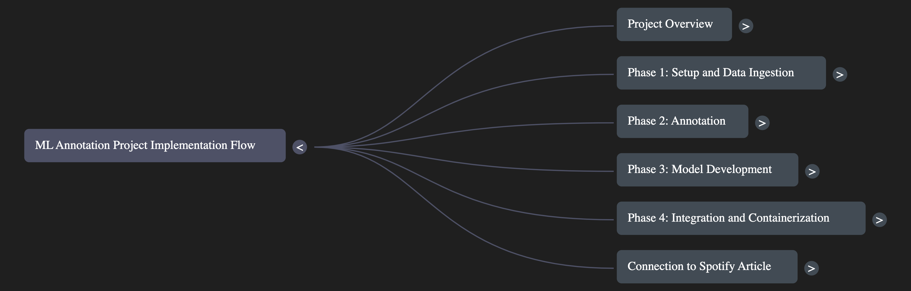

# Real-Time Spotify Music Recommendation Pipeline

## Overview

This project implements a real-time music recommendation pipeline, leveraging a suite of cutting-edge technologies to provide personalized music suggestions. The system is designed to enhance user engagement, drive music discovery, and increase user satisfaction by tailoring recommendations to individual preferences. [cite: 608, 609, 610]



## Technologies Used

The pipeline integrates the following technologies:

* **Spotify API:** For accessing track play events and music catalog data. [cite: 610, 681]
   
* **Apache Kafka:** A distributed streaming platform for real-time data ingestion and processing. [cite: 610, 650]
   
* **Apache Flink:** A powerful framework for real-time data ingestion, preprocessing, and analytics. [cite: 610, 665, 666]
   
* **Pinecone:** A vector database for efficient similarity search, enabling personalized recommendations. [cite: 610, 730, 731]
   
* **Sentence Transformers:** A Python library for generating meaningful song embeddings. [cite: 610, 720, 721]
   
* **PySpark MLlib:** Apache Spark's machine learning library for collaborative filtering. [cite: 610, 743, 744]
   
* **TensorFlow Extended (TFX):** For building and deploying production-ready machine learning pipelines (conceptual overview). [cite: 610, 775, 776]
   
* **Flink SQL:** For performing real-time analytics on streaming data using SQL queries. [cite: 610, 784, 785]
   
* **Tableau, Streamlit, Plotly:** For data visualization and dashboarding. [cite: 610]
   
* **Docker:** For containerizing the entire project, ensuring ease of deployment and reproducibility. [cite: 611, 612]

## Project Highlights

* **Real-time music recommendations:** The system processes data in real-time to provide up-to-date suggestions. [cite: 609, 610]
   
* **Containerized with Docker:** Simplified setup and consistent environments across development and production. [cite: 611, 612, 613, 614]
   
* **Scalable architecture:** Leverages Kafka and Flink for handling large volumes of streaming data. [cite: 650, 665, 666]
   
* **Hybrid recommendation approach:** Combines collaborative filtering and content-based similarity for improved accuracy. [cite: 766, 767]

## Getting Started

### Prerequisites

* Docker Desktop or a compatible alternative (Podman, Rancher Desktop, OrbStack, containerd) [cite: 615, 616, 617, 618, 619, 620, 621, 622, 623, 624, 625, 626, 627, 628, 629]
* Spotify API credentials (Client ID and Client Secret) [cite: 682, 683, 684]
* Pinecone account and API key [cite: 732]

### Installation

1.  Clone the repository:
    ```bash
    git clone <repository_url>
    cd <repository_name>
    ```
2.  Set up environment variables (Spotify API credentials, Pinecone API key, etc.).
3.  Build and run the services using Docker Compose:
    ```bash
    docker-compose up -d
    ```

## Architecture

The system architecture is defined in the `docker-compose.yml` file and comprises the following services:

* **Zookeeper:** For Kafka cluster management. [cite: 636-655]
   
* **Kafka:** The message broker for handling track play events. [cite: 636-664]

* **Flink JobManager:** Coordinates the Flink jobs. [cite: 673-679]
   
* **Flink TaskManager:** Executes the Flink tasks. [cite: 673-679]

## Pipeline Stages

1.  **Data Ingestion and Preprocessing:**
    * Ingest track play events from the Spotify API. [cite: 681-687]
    * Stream data with Flink and Kafka. [cite: 692-701]
    * Enrich data with audio features from the Spotify API. [cite: 702-710]
    * Normalize audio features in Flink. [cite: 711-717]

2.  **Vector Database Integration:**
    * Generate song embeddings using Sentence Transformers. [cite: 720-729]
    * Index songs in Pinecone for semantic search. [cite: 730-741]

3.  **Machine Learning Recommendation Pipeline:**
    * Implement user-song recommendations with PySpark MLlib (Collaborative Filtering). [cite: 743-757]
    * Perform hourly clustering of audio features with Flink. [cite: 758-765]
    * Create hybrid recommendations by combining PySpark and Pinecone results. [cite: 766-774]
    * (Conceptual Overview) MLOps and automation with TFX. [cite: 775-781]

4.  **Real-Time Stream Processing and Analytics:**
    * Integrate Kafka with Flink SQL. [cite: 786-795]
    * Identify popular trends with real-time dashboards. [cite: 796-805]
    * Analyze user engagement with artist analytics. [cite: 806-815]
    * Detect anomalies using Z-score analysis. [cite: 816-823]

## Contributing

(Add your contributing guidelines here)

## License

(Add your project's license here)

## Acknowledgements

(Add any acknowledgements here)
